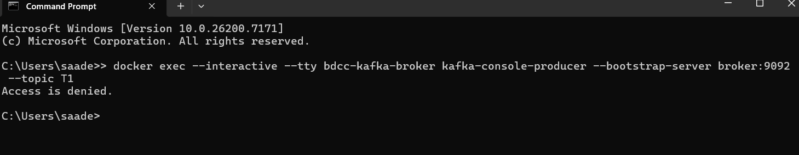
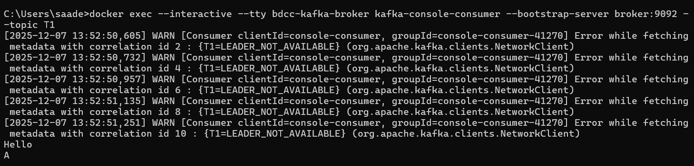
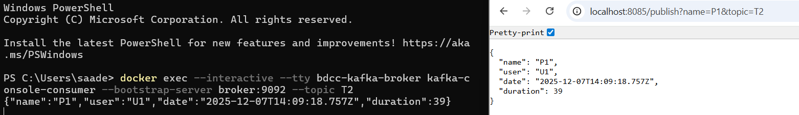
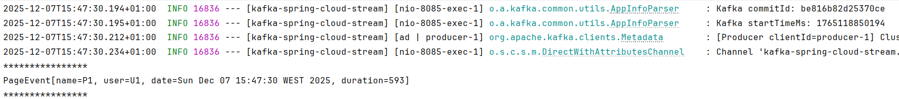
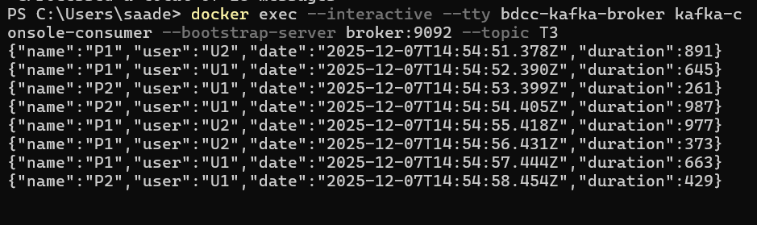
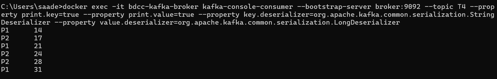
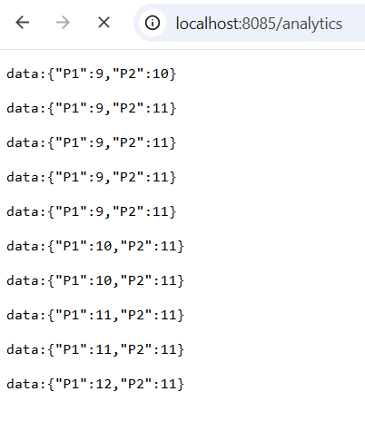
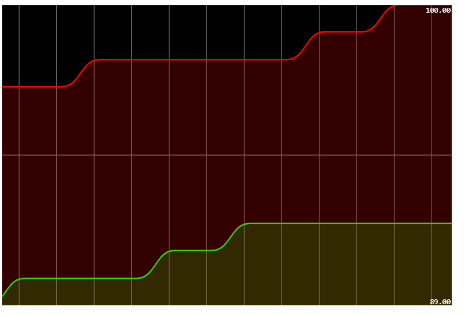

# TP Kafka – Spring Cloud Stream & Kafka Streams

Ce projet illustre l’utilisation de **Kafka** avec **Spring Boot / Spring Cloud Stream** pour construire une chaîne complète de traitement temps réel :

- Installation et test de base de Kafka
- Services Producer / Consumer / Supplier
- Traitement temps réel avec Kafka Streams
- Application Web pour visualiser les résultats en direct

---

## 1. Téléchargement & Installation de Kafka

Téléchargement d’Apache Kafka, décompression et préparation de l’environnement.

---

## 2. Démarrage de Zookeeper

Lancement du service **Zookeeper** nécessaire à Kafka :

- Soit via script `zookeeper-server-start.sh` / `.bat`
- Soit via `docker-compose` (service `zookeeper`)

---

## 3. Démarrage de Kafka Server

Démarrage du **Kafka Broker** :

- Script `kafka-server-start.sh` / `.bat`
- Ou service `broker` dans `docker-compose.yml`

---

## 4. Test avec kafka-console-producer & kafka-console-consumer

Création d’un topic de test et envoi/réception de messages via la ligne de commande :

- `kafka-console-producer` pour publier des messages
- `kafka-console-consumer` pour les consommer

**Capture d’écran :**
> 📷 
> 📷 

---

## 5. Service Producer Kafka (REST Controller)

Mise en place d’un **service REST** qui joue le rôle de **Producer** :

- Endpoint `/publish` (ex. `GET /publish?name=xxx&topic=T2`)
- Utilisation de `StreamBridge` pour envoyer un `PageEvent` vers un topic Kafka

**Capture d’écran :**
> 📷 

---

## 6. Service Consumer Kafka

Création d’un **Consumer** avec Spring Cloud Stream :

- Déclaration d’un `@Bean Consumer<PageEvent>`
- Lecture des messages à partir du topic (ex. `T2`)
- Affichage du contenu dans la console

**Capture d’écran :**
> 📷 

---

## 7. Service Supplier Kafka

Mise en place d’un **Supplier** qui génère périodiquement des événements :

- `@Bean Supplier<PageEvent>`
- Envoi automatique d’événements vers un topic Kafka
- Utilisation possible d’un intervalle configuré (fixedDelay, etc.)

**Capture d’écran :**
> 📷 

---

## 8. Service de Data Analytics – Kafka Streams

Implémentation d’un traitement temps réel avec **Kafka Streams** :

- Lecture des événements depuis un topic source
- Agrégation / comptage par fenêtre de temps (`windowedBy(TimeWindows...)`)
- Écriture des résultats dans un topic de sortie (ex. `T4`)

**Capture d’écran :**
> 📷 

---

## 9. Application Web – Visualisation Temps Réel

Création d’une petite **application Web** qui :

- Consomme les résultats du topic d’analytics
- Affiche les statistiques en temps réel (tableau, graphiques, etc.)

**Capture d’écran :**
> 📷 
> 📷 

---

## Lancement du Projet

1. Démarrer Zookeeper & Kafka (ou `docker-compose up`).
2. Lancer l’application Spring Boot.
3. Tester :
    - Producer REST : `http://localhost:8085/publish?name=Test&topic=T2`
    - Vérifier la consommation dans la console (Consumer / Streams).
    - Ouvrir l’UI Web pour voir les résultats temps réel.

---